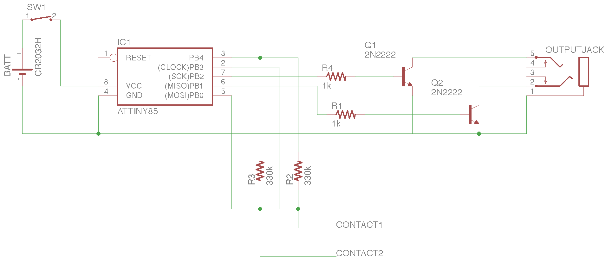

# attiny85 Morse Keyer
A minimalist morse code keyer using an attiny85 micro and capacitive touch

---
###Schematic

### TODO:

* create and upload schematic
* port to AVR-C
* upload photos of example build

